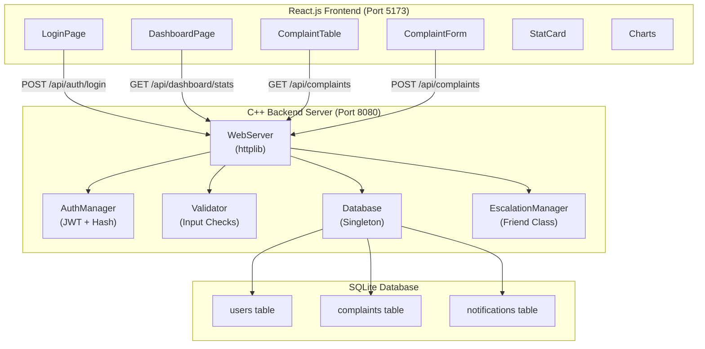
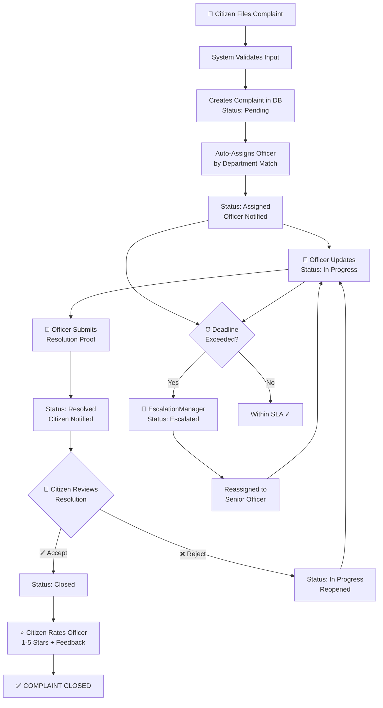
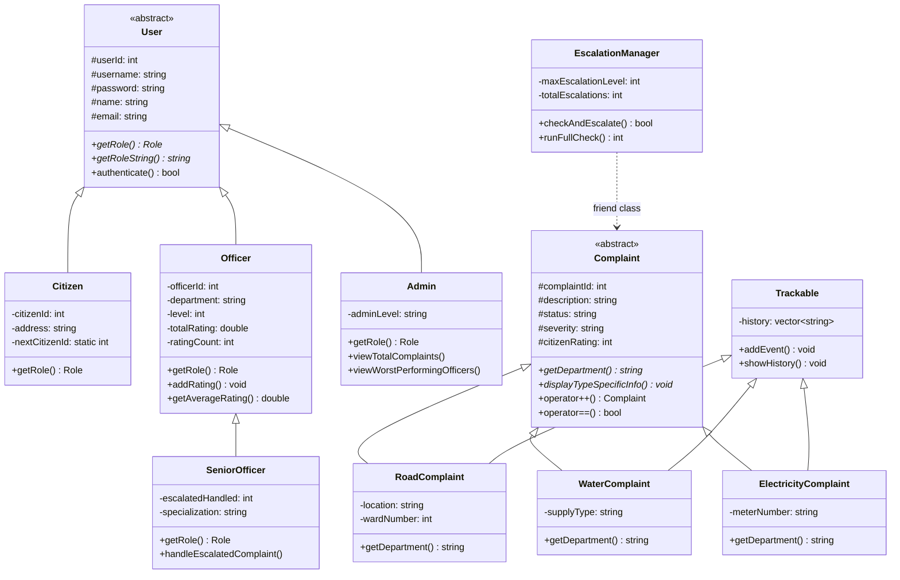

# 🏛️ SPCMS — Smart Public Complaint Management System

> **A Full-Stack, Production-Grade Complaint Management Platform**  
> Built with C++ (OOP) Backend + React.js Frontend + SQLite Database  
> Demonstrates **20+ OOP concepts** in a real-world application

---

## ✨ Features

- 🔐 **JWT Authentication** — Secure login/signup with password hashing (salt + DJB2)
- 👥 **4 User Roles** — Citizen, Officer, Senior Officer, Admin
- 📋 **Complaint Lifecycle** — Register → Assign → Resolve → Accept/Reject → Close
- ⏰ **Auto-Escalation Engine** — Overdue complaints escalated automatically
- ⭐ **Officer Rating System** — Citizens rate officers 1-5 stars after resolution
- 📊 **Analytics Dashboard** — Charts (Bar, Doughnut, Line) with Chart.js
- 🌙 **Dark/Light Mode** — Theme toggle with localStorage persistence
- 🔔 **Notification System** — Real-time alerts for status changes
- 📱 **Responsive Design** — Works on desktop, tablet, and mobile
- 🗃️ **SQLite Database** — Persistent storage with Singleton pattern

---

## 🏗️ System Architecture



---

## 📁 Project Structure

```
Complaint_management_system_oop-main/
│
├── 📄 main.cpp                    # Console app entry point (menu-based UI)
├── 📄 web_main.cpp                # Web server entry point (REST API)
├── 📄 compile.bat                 # Build script for console app
├── 📄 compile_web.bat             # Build script for web server
├── 📄 spcms.exe                   # Console application binary
├── 📄 spcms_web.exe               # Web server binary
├── 📄 PROJECT_WORKING.md          # Detailed project working document
│
├── 📂 include/                    # C++ Header Files
│   ├── User.h                     # Abstract base class (pure virtual)
│   ├── Citizen.h                  # Derived: User → Citizen
│   ├── Officer.h                  # Derived: User → Officer
│   ├── SeniorOfficer.h            # Derived: User → Officer → SeniorOfficer (multilevel)
│   ├── Admin.h                    # Derived: User → Admin
│   ├── Complaint.h                # Abstract base class (pure virtual)
│   ├── RoadComplaint.h            # Derived: Complaint + Trackable (multiple inheritance)
│   ├── WaterComplaint.h           # Derived: Complaint + Trackable
│   ├── ElectricityComplaint.h     # Derived: Complaint + Trackable
│   ├── Trackable.h                # Mixin class for event history
│   ├── ComplaintSystem.h          # Central controller (composition)
│   ├── EscalationManager.h        # Friend class of Complaint
│   ├── Exceptions.h               # Custom exception hierarchy
│   ├── Validator.h                # Static validation methods
│   ├── Database.h                 # SQLite wrapper (Singleton)
│   ├── AuthManager.h              # JWT + password hashing
│   ├── WebServer.h                # REST API server (composition)
│   ├── JsonUtil.h                 # JSON serialization utilities
│   ├── ConsoleUI.h                # Terminal UI rendering engine
│   ├── DashboardWriter.h          # JSON export for dashboard
│   ├── httplib.h                  # HTTP server library (cpp-httplib)
│   └── sqlite3.h                  # SQLite C library header
│
├── 📂 src/                        # C++ Source Files
│   ├── User.cpp                   # Base user implementation
│   ├── Citizen.cpp                # Citizen methods
│   ├── Officer.cpp                # Officer methods + rating system
│   ├── SeniorOfficer.cpp          # Senior officer specialization
│   ├── Admin.cpp                  # Admin analytics methods
│   ├── Complaint.cpp              # Complaint lifecycle logic
│   ├── RoadComplaint.cpp          # Road-specific display + forwarding
│   ├── WaterComplaint.cpp         # Water-specific logic
│   ├── ElectricityComplaint.cpp   # Electricity-specific logic
│   ├── ComplaintSystem.cpp        # Core business logic (40K+ lines)
│   ├── EscalationManager.cpp      # Auto-escalation engine
│   ├── Validator.cpp              # Input validation (regex)
│   ├── Database.cpp               # SQLite CRUD operations
│   ├── AuthManager.cpp            # JWT generation/verification
│   ├── WebServer.cpp              # REST API route handlers
│   ├── ConsoleUI.cpp              # Terminal UI drawing
│   ├── Trackable.cpp              # Event history tracking
│   └── sqlite3.c                  # SQLite C library source
│
├── 📂 frontend/                   # React.js Frontend
│   ├── package.json               # Dependencies (react, chart.js, lucide)
│   ├── vite.config.js             # Vite config with API proxy
│   ├── index.html                 # HTML entry point
│   └── src/
│       ├── main.jsx               # React entry point
│       ├── App.jsx                # Router + context providers
│       ├── index.css              # Complete design system (23K+ lines)
│       ├── context/
│       │   ├── AuthContext.jsx    # Authentication state + API calls
│       │   └── ThemeContext.jsx   # Dark/Light mode toggle
│       ├── pages/
│       │   ├── LoginPage.jsx      # Login/Signup with tabbed UI
│       │   └── DashboardPage.jsx  # Main dashboard layout
│       ├── components/
│       │   ├── Sidebar.jsx        # Role-based navigation
│       │   ├── Topbar.jsx         # Theme toggle + notifications
│       │   ├── StatCard.jsx       # Animated stat counter cards
│       │   ├── BarChart.jsx       # Complaints by category
│       │   ├── DoughnutChart.jsx  # Status distribution
│       │   ├── LineChart.jsx      # Complaints over time
│       │   ├── ComplaintTable.jsx # Searchable complaint list
│       │   ├── ComplaintForm.jsx  # New complaint form
│       │   ├── ProfileCard.jsx   # User profile display
│       │   ├── UserTable.jsx      # Admin user management
│       │   └── ProtectedRoute.jsx # Auth route guard
│       └── utils/
│           ├── api.js             # Fetch wrapper with JWT
│           └── validation.js      # Client-side validation
│
├── 📂 public/                     # Static files served by C++ server
│   ├── index.html                 # Legacy login page
│   ├── dashboard.html             # Legacy dashboard
│   ├── css/styles.css             # Legacy CSS
│   └── js/                        # Legacy JavaScript
│
├── 📂 data/                       # Runtime Data
│   └── spcms.db                   # SQLite database file
│
└── 📂 uploads/                    # Complaint attachments
```

---

## 🔄 Complaint Lifecycle Flow



---

## 🧬 OOP Concepts Demonstrated

### Class Hierarchy



### OOP Concepts Checklist

| # | Concept | File(s) | Example |
|---|---------|---------|---------|
| 1 | **Class & Object** | All `.h`/`.cpp` | `Citizen c("Rajesh", ...)` |
| 2 | **Encapsulation** | All classes | Private data + public getters/setters |
| 3 | **Abstraction** | `User.h`, `Complaint.h` | Pure virtual `getRole() = 0` |
| 4 | **Single Inheritance** | `Citizen.h` | `class Citizen : public User` |
| 5 | **Multilevel Inheritance** | `SeniorOfficer.h` | `User → Officer → SeniorOfficer` |
| 6 | **Hierarchical Inheritance** | `RoadComplaint.h` etc. | 3 classes derive from `Complaint` |
| 7 | **Multiple Inheritance** | `RoadComplaint.h` | `class RoadComplaint : public Complaint, public Trackable` |
| 8 | **Polymorphism (Runtime)** | `ComplaintSystem.cpp` | `vector<Complaint*>` calling virtual methods |
| 9 | **Pure Virtual Functions** | `Complaint.h` | `virtual string getDepartment() const = 0;` |
| 10 | **Virtual Functions** | `Complaint.h` | `virtual void forwardToOfficer();` |
| 11 | **Virtual Destructor** | `User.h`, `Complaint.h` | `virtual ~Complaint();` |
| 12 | **Function Overriding** | `RoadComplaint.cpp` | `getDepartment()` returns `"Road"` |
| 13 | **Operator Overloading** | `Complaint.h` | `++` (unary), `==` (binary), `<<` (stream) |
| 14 | **Friend Function** | `Complaint.h` | `friend void displayFullReport(const Complaint&)` |
| 15 | **Friend Class** | `Complaint.h` | `friend class EscalationManager` |
| 16 | **Static Members** | `Complaint.h`, `User.h` | `static int nextId;` |
| 17 | **Static Methods** | `Validator.h` | `static ValidationResult validateEmail(...)` |
| 18 | **this Pointer** | All setters | `this->name = n;` |
| 19 | **Inline Functions** | All getters | `inline int getId() const { return id; }` |
| 20 | **Constructor Overloading** | All classes | Default, Parameterized, Copy |
| 21 | **Copy Constructor** | `Complaint.h` | `Complaint(const Complaint& other)` |
| 22 | **Scope Resolution** | All `.cpp` files | `void Complaint::setStatus(...)` |
| 23 | **Access Specifiers** | All classes | `private`, `protected`, `public` |
| 24 | **Enum Class** | `User.h` | `enum class Role { CITIZEN, OFFICER, ... }` |
| 25 | **Exception Handling** | `Exceptions.h` | `try-catch` with custom exceptions |
| 26 | **Custom Exceptions** | `Exceptions.h` | `class ComplaintNotFoundException : public exception` |
| 27 | **Nested Struct** | `AuthManager.h` | `struct TokenPayload { ... }` inside class |
| 28 | **STL Vectors** | `ComplaintSystem.h` | `vector<Complaint*> complaints` |
| 29 | **STL Maps** | `Database.h` | `map<string, int> getStatsSummary()` |
| 30 | **File I/O** | `ComplaintSystem.cpp` | `ofstream`, `ifstream` for persistence |
| 31 | **Singleton Pattern** | `Database.h` | Private constructor + static `getInstance()` |
| 32 | **Composition** | `WebServer.h` | Contains `Database&` + `AuthManager` |
| 33 | **Dynamic Memory** | `ComplaintSystem.cpp` | `new RoadComplaint(...)`, `delete` in destructor |
| 34 | **Pointers to Objects** | `ComplaintSystem.h` | `vector<Complaint*>` for polymorphism |
| 35 | **RAII** | `Database.cpp` | `~Database() { sqlite3_close(db); }` |

---

## 🚀 Quick Start

### Prerequisites

- **g++ (MinGW-w64 POSIX)** — C++17 compiler
- **Node.js v18+** — For React frontend
- **npm** — Package manager

### Build & Run

#### Option 1: Web Application (Recommended)

```bash
# Terminal 1 — Build & start C++ backend
cd Complaint_management_system_oop-main
.\compile_web.bat         # Compile (first time only)
.\spcms_web.exe           # Start API server on :8080

# Terminal 2 — Start React frontend
cd frontend
npm install               # Install dependencies (first time only)
npm run dev               # Start dev server on :5173
```

Open **http://localhost:5173** in your browser.

#### Option 2: Console Application

```bash
.\compile.bat             # Compile
.\spcms.exe               # Run terminal-based app
```

### Demo Accounts

| Role | Email | Password |
|------|-------|----------|
| Admin | admin@spcms.gov.in | Admin@123 |
| Senior Officer | senior@spcms.gov.in | Senior@123 |
| Officer | sharma@pwd.gov.in | Officer@123 |
| Citizen | rajesh@gmail.com | Citizen@123 |

---

## 🛠️ Tech Stack

| Layer | Technology | Purpose |
|-------|-----------|---------|
| **Backend** | C++17 | Business logic, OOP class hierarchy |
| **Web Server** | cpp-httplib | HTTP server, REST API routing |
| **Database** | SQLite3 | Persistent storage |
| **Auth** | Custom JWT | Token-based authentication |
| **Frontend** | React.js 19 + Vite 8 | Modern SPA dashboard |
| **Charts** | Chart.js + react-chartjs-2 | Data visualization |
| **Icons** | Lucide React | SVG icon library |
| **Routing** | React Router DOM v7 | Client-side navigation |
| **Styling** | Vanilla CSS | Custom design system with themes |

---

## 📜 License

This project is built for educational purposes as a C++ OOP course project.

---

*Built with ❤️ using C++ and React.js*